# Atena - Asistente Virtual con OCI Generative AI

Un chatbot minimalista con Python (FastAPI) como backend y Next.js como frontend, integrado con OCI Generative AI.

## Arquitectura

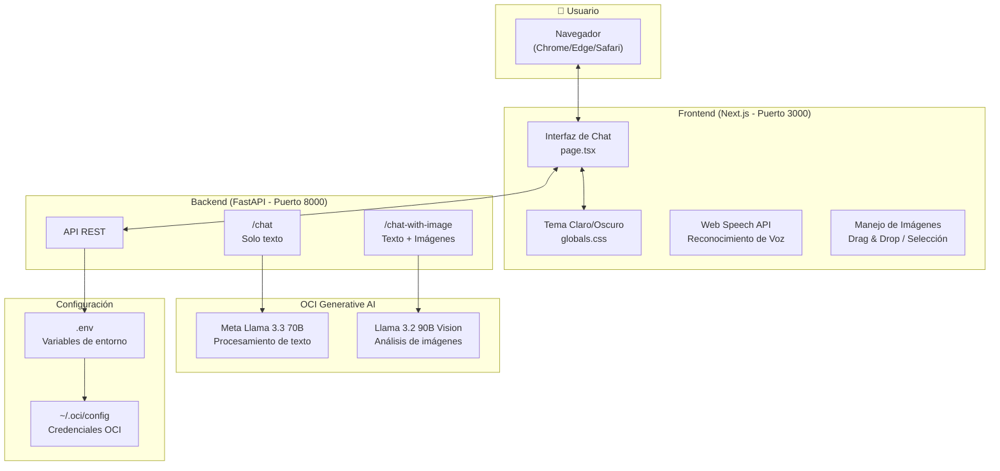

## Características

- ✨ Interfaz minimalista y elegante
- 🌓 Tema claro / oscuro
- 💬 Historial de conversación persistente en sesión
- 📷 **Análisis de imágenes con Llama 3.2 Vision**
- 🎤 Entrada de voz (ES, EN, PT-BR)
- 📋 Botón copiar código y mensajes
- 🖱️ Drag & drop para imágenes
- 📱 Diseño responsive
- ⌨️ Envío con Enter, nueva línea con Shift+Enter

## Demo

### Interfaz principal
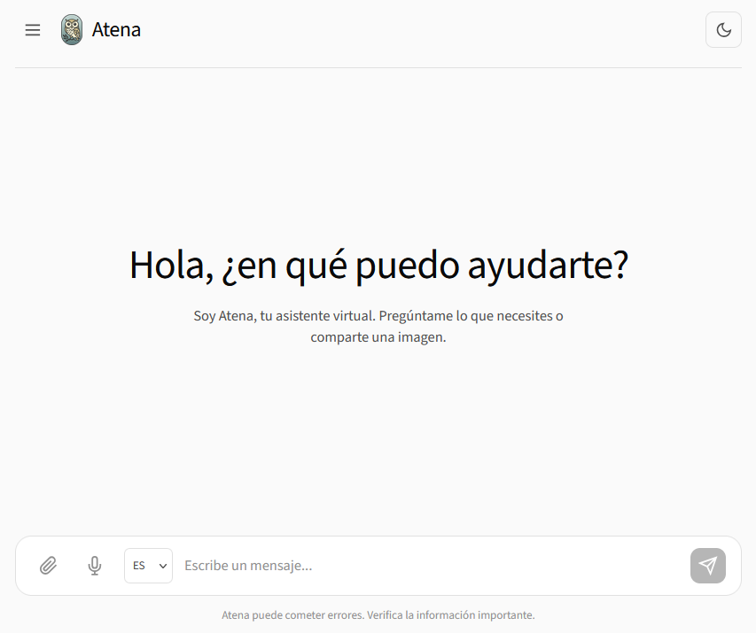

### Tema claro y oscuro
| Claro | Oscuro |
|-------|--------|
| 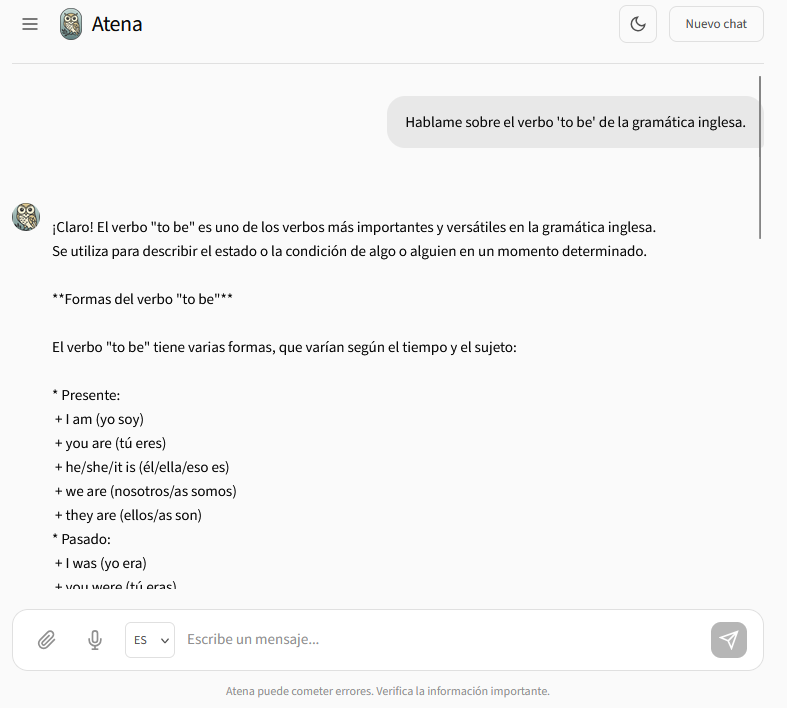 | 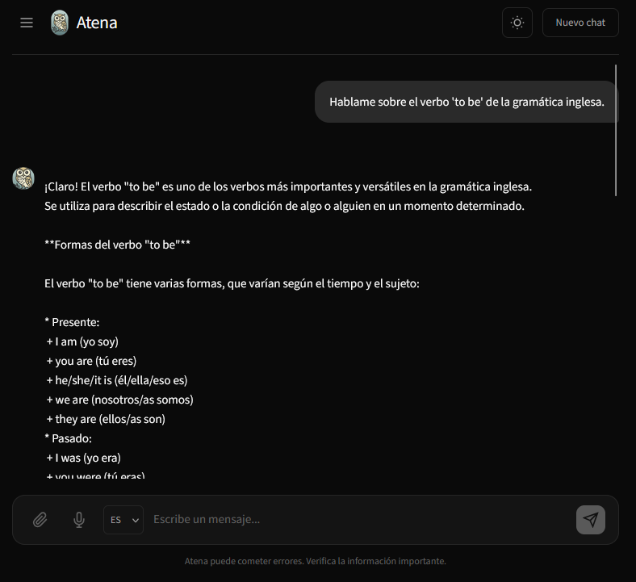 |

### Conversación con el asistente
| Claro | Oscuro |
|-------|--------|
| 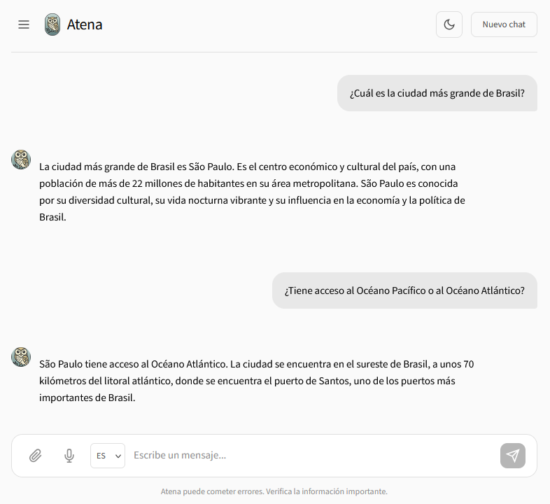 | 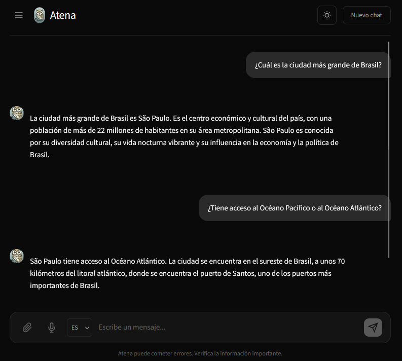 |

### Respuestas detalladas
| Claro | Oscuro |
|-------|--------|
| 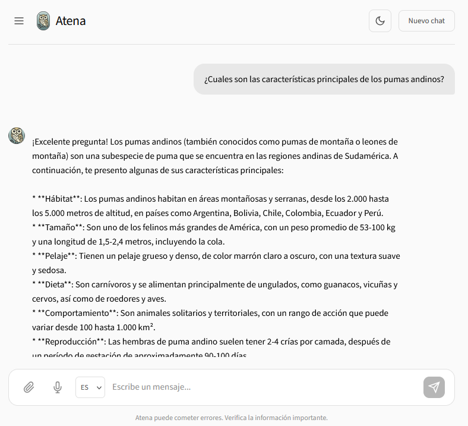 | 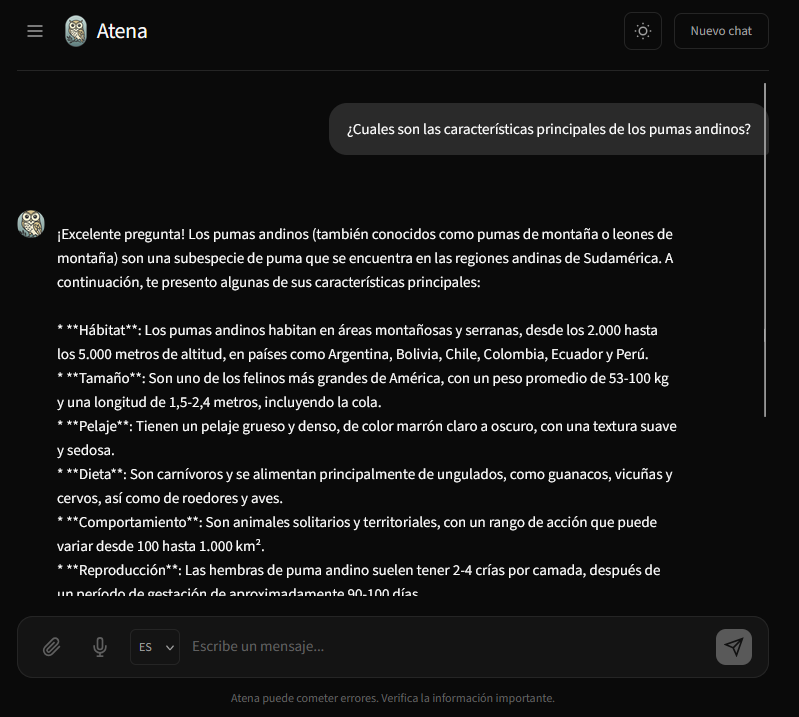 |

### Historial de conversaciones
| Claro | Oscuro |
|-------|--------|
| 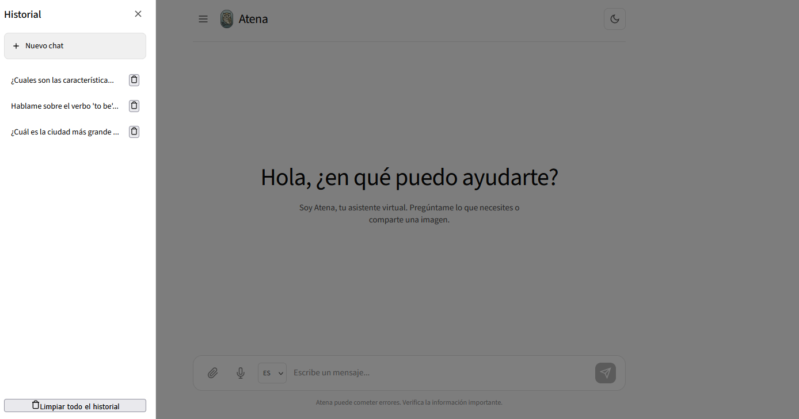 | 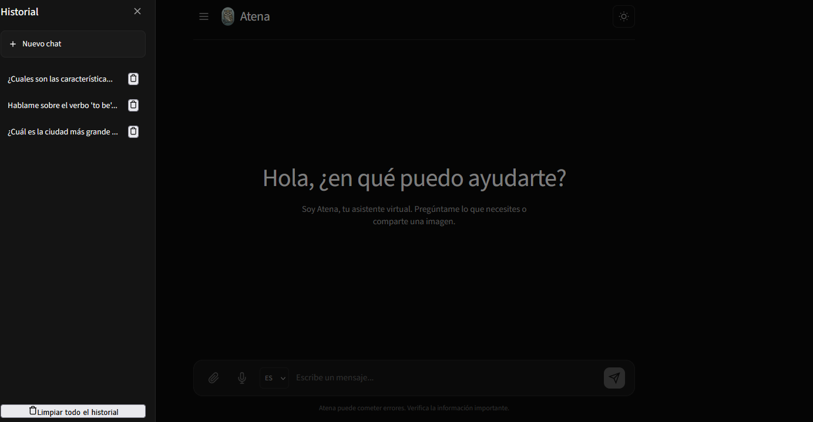 |

### Análisis de imágenes (Llama 3.2 Vision)
| Selección de imágenes | Respuesta del modelo |
|----------------------|----------------------|
| 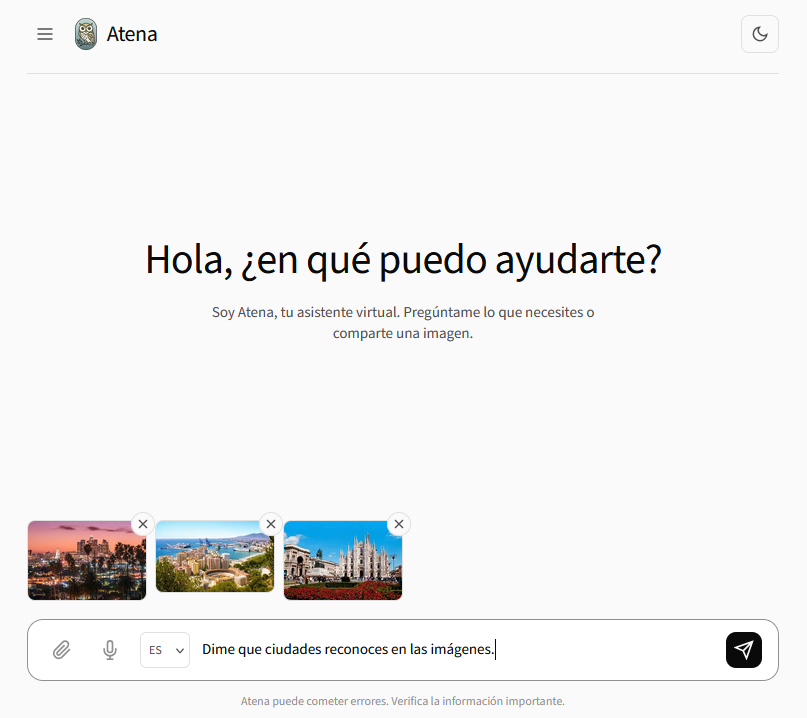 | 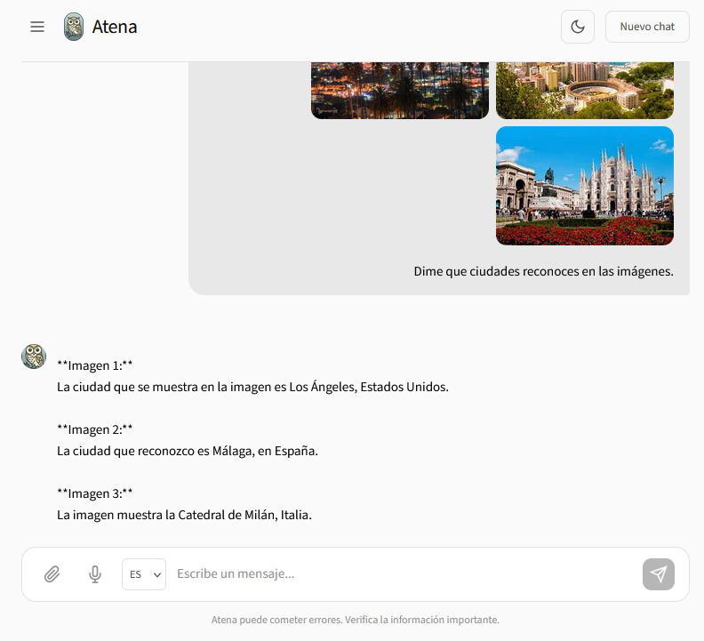 |

### Soporte multiidioma
| Español | English | Português |
|---------|---------|-----------|
|  | 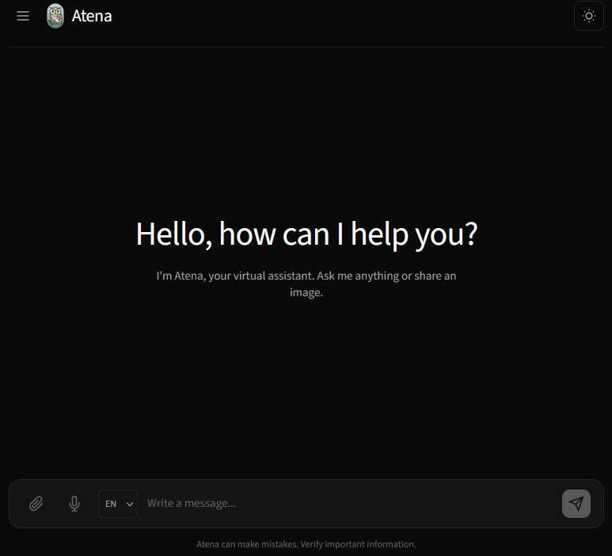 | 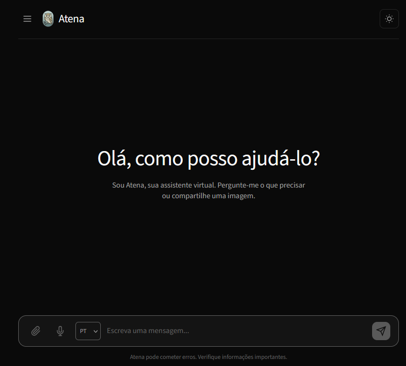 |

## Requisitos previos

1. **Cuenta OCI** con acceso a Generative AI
2. **API Key** configurada en `~/.oci/config`
3. **Compartment** con políticas de acceso a Generative AI
4. **Python 3.12**
5. **Node.js 18+**

## Estructura del proyecto

```
proyecto/
├── Backend-OCI/
│   ├── main.py              # API con FastAPI
│   ├── requirements.txt     # Dependencias Python
│   ├── test_oci_connection.py  # Script de diagnóstico
│   └── .env                 # Variables de entorno
│
└── Frontend/
    ├── public/
    │   ├── favicon.svg      # Ícono del sitio
    │   └── owl-logo.png     # Logo de Atena
    ├── src/
    │   └── app/
    │       ├── layout.tsx   # Layout principal
    │       ├── page.tsx     # Página del chat
    │       ├── globals.css  # Estilos globales
    │       └── page.module.css
    ├── package.json
    ├── tsconfig.json
    └── next.config.js
```

## Configuración

### 1. Configuración OCI

#### Generar llaves API (Git Bash)

```bash
cd ~/.oci
openssl genrsa -out oci_api_key.pem 2048
openssl rsa -pubout -in oci_api_key.pem -out oci_api_key_public.pem
```

#### Subir llave pública a OCI

1. **OCI Console** → **Profile** → **My Profile**
2. **API Keys** → **Add API Key**
3. **Paste Public Key** → pegar contenido de `oci_api_key_public.pem`
4. Copiar el **fingerprint** generado

#### Archivo de configuración (`~/.oci/config`)

```ini
[DEFAULT]
user=ocid1.user.oc1..xxxxx
fingerprint=xx:xx:xx:xx:xx:xx:xx:xx:xx:xx:xx:xx:xx:xx:xx:xx
tenancy=ocid1.tenancy.oc1..xxxxx
region=us-chicago-1
key_file=C:\Users\TU_USUARIO\.oci\oci_api_key.pem
```

> **Nota Windows:** Usar ruta completa en `key_file`

#### Política de acceso

Crear en Identity & Security → Policies:

```
allow any-user to manage generative-ai-family in compartment <nombre-compartment>
```

### 2. Backend

```bash
cd Backend-OCI

# Crear entorno virtual
python -m venv .venv

# Activar entorno virtual
# Windows PowerShell:
.\.venv\Scripts\Activate.ps1
# Windows CMD:
.venv\Scripts\activate
# Linux/Mac:
source .venv/bin/activate

# Instalar dependencias
pip install -r requirements.txt
```

#### Variables de entorno (.env)

Crear archivo `Backend-OCI/.env`:

```env
OCI_CONFIG_FILE=C:\Users\TU_USUARIO\.oci\config
OCI_CONFIG_PROFILE=DEFAULT
OCI_COMPARTMENT_ID=ocid1.compartment.oc1..tu_ocid_completo
OCI_SERVICE_ENDPOINT=https://inference.generativeai.us-chicago-1.oci.oraclecloud.com
OCI_MODEL_ID=meta.llama-3.3-70b-instruct
OCI_VISION_MODEL_ID=meta.llama-3.2-90b-vision-instruct
```

#### Verificar conexión

```bash
python test_oci_connection.py
```

#### Ejecutar backend

```bash
python main.py
```

El servidor estará en `http://localhost:8000`

### 3. Frontend

```bash
cd Frontend

# Instalar dependencias
npm install

# Iniciar servidor de desarrollo
npm run dev
```

El frontend estará en `http://localhost:3000`

## Uso

1. Inicia el backend (puerto 8000)
2. Inicia el frontend (puerto 3000)
3. Abre `http://localhost:3000` en tu navegador
4. ¡Empieza a chatear!

### Funcionalidades

| Función | Cómo usar |
|---------|-----------|
| Enviar mensaje | Escribe y presiona Enter o clic en enviar |
| Nueva línea | Shift + Enter |
| Adjuntar imágenes | Clic en 📎 o arrastra imágenes al chat |
| Analizar imagen | Adjunta imagen + escribe pregunta |
| Entrada de voz | Clic en 🎤, habla, clic de nuevo para detener |
| Cambiar idioma de voz | Selecciona ES/EN/PT antes de grabar |
| Copiar código | Clic en "Copiar" en bloques de código |
| Copiar mensaje | Hover sobre mensaje y clic en ícono copiar |
| Cambiar tema | Clic en ícono ☀️/🌙 |
| Nuevo chat | Clic en "Nuevo chat" |

## API Endpoints

| Método | Endpoint | Descripción | Modelo |
|--------|----------|-------------|--------|
| GET | `/` | Estado del servidor | - |
| GET | `/health` | Health check | - |
| POST | `/chat` | Enviar mensaje de texto | Llama 3.3 70B |
| POST | `/chat-with-image` | Enviar mensaje con imágenes | Llama 3.2 90B Vision |

### Ejemplo POST /chat

```json
{
  "message": "Hola, ¿cómo estás?",
  "conversation_history": []
}
```

### Ejemplo POST /chat-with-image

```
FormData:
- message: "¿Qué hay en esta imagen?"
- conversation_history: "[]"
- images: [archivo1.jpg, archivo2.png]
```

## Modelos disponibles en OCI

| Modelo | Tipo | Uso |
|--------|------|-----|
| `meta.llama-3.3-70b-instruct` | Texto | Chat general - balance calidad/costo |
| `meta.llama-3.1-405b-instruct` | Texto | Mayor capacidad |
| `meta.llama-3.2-90b-vision-instruct` | Visión | **Análisis de imágenes** |
| `meta.llama-3.2-11b-vision-instruct` | Visión | Análisis de imágenes (más rápido) |
| `cohere.command-r-plus-08-2024` | Texto | Alternativa Cohere |

## Regiones con Generative AI

| Región | Identificador |
|--------|---------------|
| US Midwest (Chicago) | `us-chicago-1` |
| Germany Central (Frankfurt) | `eu-frankfurt-1` |
| UK South (London) | `uk-london-1` |

## Solución de problemas

### Error: "Failed to verify the HTTP(S) Signature"

La llave privada no coincide con la pública en OCI. Regenerar llaves:

```bash
cd ~/.oci
openssl genrsa -out oci_api_key.pem 2048
openssl rsa -pubout -in oci_api_key.pem -out oci_api_key_public.pem
```

Luego subir la nueva llave pública a OCI Console.

### Error: "NotAuthorizedOrNotFound"

- Verificar que el `OCI_COMPARTMENT_ID` es correcto
- Verificar políticas IAM en OCI Console

### Error al analizar imágenes

- Verificar que `OCI_VISION_MODEL_ID` está configurado
- El modelo de visión debe estar disponible en tu región

### Script de diagnóstico

```bash
cd Backend-OCI
python test_oci_connection.py
```

## Tecnologías

**Backend:**
- Python 3.12
- FastAPI 0.115.0
- OCI SDK for Python
- Uvicorn 0.30.0

**Frontend:**
- Next.js 14
- React 18
- TypeScript
- CSS Modules
- Web Speech API

## Navegadores compatibles

| Navegador | Soporte |
|-----------|---------|
| Google Chrome | ✅ Completo |
| Microsoft Edge | ✅ Completo |
| Safari | ✅ Completo |
| Firefox | ⚠️ Sin soporte de voz |

## Archivos ignorados (.gitignore)

```gitignore
# Variables de entorno
.env

# Python
.venv/
__pycache__/
*.pyc

# Node.js / Next.js
node_modules/
.next/
out/

# IDEs
.vscode/
.idea/

# OS
.DS_Store
Thumbs.db

# Seguridad
*.pem
.oci/
```

## Licencia

El código fuente está bajo licencia [MIT](LICENSE).

Los elementos de marca (nombre "Atena", logo de la lechuza, favicon) son propiedad del autor y no están cubiertos por la licencia MIT. Ver [LICENSE](LICENSE) para más detalles.