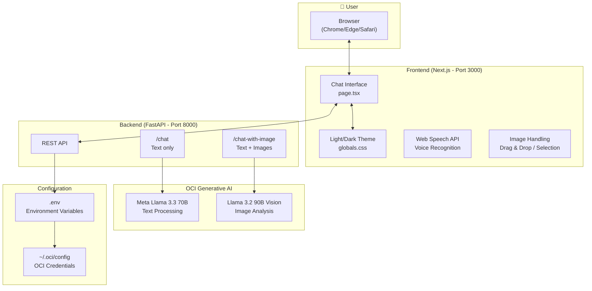

# Atena - Virtual Assistant with OCI Generative AI

A minimalist chatbot with Python (FastAPI) as backend and Next.js as frontend, integrated with OCI Generative AI.

*[Leia em português](README.pt.md) | [Leer en español](README.es.md)*

## Architecture



## Features

- ✨ Minimalist and elegant interface
- 🌓 Light / dark theme
- 💬 Session-persistent conversation history
- 📷 **Image analysis with Llama 3.2 Vision**
- 🎤 Voice input (ES, EN, PT-BR)
- 📋 Copy code and messages button
- 🖱️ Drag & drop for images
- 📱 Responsive design
- ⌨️ Send with Enter, new line with Shift+Enter

## Demo

### Main Interface


### Light and Dark Theme
| Light | Dark |
|-------|------|
|  |  |

### Conversation with the Assistant
| Light | Dark |
|-------|------|
|  |  |

### Detailed Responses
| Light | Dark |
|-------|------|
|  |  |

### Conversation History
| Light | Dark |
|-------|------|
|  |  |

### Image Analysis (Llama 3.2 Vision)
| Image Selection | Model Response |
|-----------------|----------------|
|  |  |

### Multi-language Support
| Español | English | Português |
|---------|---------|-----------|
|  |  |  |

## Prerequisites

1. **OCI Account** with access to Generative AI
2. **API Key** configured in `~/.oci/config`
3. **Compartment** with Generative AI access policies
4. **Python 3.12**
5. **Node.js 18+**

## Project Structure

```
project/
├── Backend-OCI/
│   ├── main.py              # FastAPI API
│   ├── requirements.txt     # Python dependencies
│   ├── test_oci_connection.py  # Diagnostic script
│   └── .env                 # Environment variables
│
└── Frontend/
    ├── public/
    │   ├── favicon.svg      # Site icon
    │   └── owl-logo.png     # Atena logo
    ├── src/
    │   └── app/
    │       ├── layout.tsx   # Main layout
    │       ├── page.tsx     # Chat page
    │       ├── globals.css  # Global styles
    │       └── page.module.css
    ├── package.json
    ├── tsconfig.json
    └── next.config.js
```

## Configuration

### 1. OCI Configuration

#### Generate API Keys (Git Bash)

```bash
cd ~/.oci
openssl genrsa -out oci_api_key.pem 2048
openssl rsa -pubout -in oci_api_key.pem -out oci_api_key_public.pem
```

#### Upload Public Key to OCI

1. **OCI Console** → **Profile** → **My Profile**
2. **API Keys** → **Add API Key**
3. **Paste Public Key** → paste content from `oci_api_key_public.pem`
4. Copy the generated **fingerprint**

#### Configuration File (`~/.oci/config`)

```ini
[DEFAULT]
user=ocid1.user.oc1..xxxxx
fingerprint=xx:xx:xx:xx:xx:xx:xx:xx:xx:xx:xx:xx:xx:xx:xx:xx
tenancy=ocid1.tenancy.oc1..xxxxx
region=us-chicago-1
key_file=C:\Users\YOUR_USER\.oci\oci_api_key.pem
```

> **Windows Note:** Use full path in `key_file`

#### Access Policy

Create in Identity & Security → Policies:

```
allow any-user to manage generative-ai-family in compartment <compartment-name>
```

### 2. Backend

```bash
cd Backend-OCI

# Create virtual environment
python -m venv .venv

# Activate virtual environment
# Windows PowerShell:
.\.venv\Scripts\Activate.ps1
# Windows CMD:
.venv\Scripts\activate
# Linux/Mac:
source .venv/bin/activate

# Install dependencies
pip install -r requirements.txt
```

#### Environment Variables (.env)

Create file `Backend-OCI/.env`:

```env
OCI_CONFIG_FILE=C:\Users\YOUR_USER\.oci\config
OCI_CONFIG_PROFILE=DEFAULT
OCI_COMPARTMENT_ID=ocid1.compartment.oc1..your_complete_ocid
OCI_SERVICE_ENDPOINT=https://inference.generativeai.us-chicago-1.oci.oraclecloud.com
OCI_MODEL_ID=meta.llama-3.3-70b-instruct
OCI_VISION_MODEL_ID=meta.llama-3.2-90b-vision-instruct
```

#### Verify Connection

```bash
python test_oci_connection.py
```

#### Run Backend

```bash
python main.py
```

Server will be at `http://localhost:8000`

### 3. Frontend

```bash
cd Frontend

# Install dependencies
npm install

# Start development server
npm run dev
```

Frontend will be at `http://localhost:3000`

## Usage

1. Start the backend (port 8000)
2. Start the frontend (port 3000)
3. Open `http://localhost:3000` in your browser
4. Start chatting!

### Features

| Feature | How to use |
|---------|------------|
| Send message | Type and press Enter or click send |
| New line | Shift + Enter |
| Attach images | Click 📎 or drag images to chat |
| Analyze image | Attach image + write question |
| Voice input | Click 🎤, speak, click again to stop |
| Change voice language | Select ES/EN/PT before recording |
| Copy code | Click "Copy" on code blocks |
| Copy message | Hover over message and click copy icon |
| Change theme | Click ☀️/🌙 icon |
| New chat | Click "New chat" |

## API Endpoints

| Method | Endpoint | Description | Model |
|--------|----------|-------------|-------|
| GET | `/` | Server status | - |
| GET | `/health` | Health check | - |
| POST | `/chat` | Send text message | Llama 3.3 70B |
| POST | `/chat-with-image` | Send message with images | Llama 3.2 90B Vision |

### Example POST /chat

```json
{
  "message": "Hello, how are you?",
  "conversation_history": []
}
```

### Example POST /chat-with-image

```
FormData:
- message: "What's in this image?"
- conversation_history: "[]"
- images: [file1.jpg, file2.png]
```

## Available Models in OCI

| Model | Type | Use |
|-------|------|-----|
| `meta.llama-3.3-70b-instruct` | Text | General chat - quality/cost balance |
| `meta.llama-3.1-405b-instruct` | Text | Higher capacity |
| `meta.llama-3.2-90b-vision-instruct` | Vision | **Image analysis** |
| `meta.llama-3.2-11b-vision-instruct` | Vision | Image analysis (faster) |
| `cohere.command-r-plus-08-2024` | Text | Cohere alternative |

## Regions with Generative AI

| Region | Identifier |
|--------|------------|
| US Midwest (Chicago) | `us-chicago-1` |
| Germany Central (Frankfurt) | `eu-frankfurt-1` |
| UK South (London) | `uk-london-1` |

## Troubleshooting

### Error: "Failed to verify the HTTP(S) Signature"

Private key doesn't match public key in OCI. Regenerate keys:

```bash
cd ~/.oci
openssl genrsa -out oci_api_key.pem 2048
openssl rsa -pubout -in oci_api_key.pem -out oci_api_key_public.pem
```

Then upload the new public key to OCI Console.

### Error: "NotAuthorizedOrNotFound"

- Verify that `OCI_COMPARTMENT_ID` is correct
- Verify IAM policies in OCI Console

### Error analyzing images

- Verify that `OCI_VISION_MODEL_ID` is configured
- Vision model must be available in your region

### Diagnostic Script

```bash
cd Backend-OCI
python test_oci_connection.py
```

## Technologies

**Backend:**
- Python 3.12
- FastAPI 0.115.0
- OCI SDK for Python
- Uvicorn 0.30.0

**Frontend:**
- Next.js 14
- React 18
- TypeScript
- CSS Modules
- Web Speech API

## Compatible Browsers

| Browser | Support |
|---------|---------|
| Google Chrome | ✅ Full |
| Microsoft Edge | ✅ Full |
| Safari | ✅ Full |
| Firefox | ⚠️ No voice support |

## Ignored Files (.gitignore)

```gitignore
# Environment variables
.env

# Python
.venv/
__pycache__/
*.pyc

# Node.js / Next.js
node_modules/
.next/
out/

# IDEs
.vscode/
.idea/

# OS
.DS_Store
Thumbs.db

# Security
*.pem
.oci/
```

## License

Source code is licensed under [MIT](LICENSE).

Brand elements (name "Atena", owl logo, favicon) are property of the author and are not covered by the MIT License. See [LICENSE](LICENSE) for details.