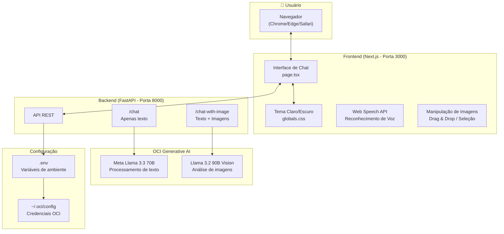

# Atena - Assistente Virtual com OCI Generative AI

Um chatbot minimalista com Python (FastAPI) como backend e Next.js como frontend, integrado com OCI Generative AI.

*[Read in English](README.md) | [Leer en español](README.es.md)*

## Arquitetura



## Funcionalidades

- ✨ Interface minimalista e elegante
- 🌓 Tema claro / escuro
- 💬 Histórico de conversas persistente na sessão
- 📷 **Análise de imagens com Llama 3.2 Vision**
- 🎤 Entrada de voz (ES, EN, PT-BR)
- 📋 Botão para copiar código e mensagens
- 🖱️ Drag & drop para imagens
- 📱 Design responsivo
- ⌨️ Enviar com Enter, nova linha com Shift+Enter

## Demo

### Interface Principal


### Tema Claro e Escuro
| Claro | Escuro |
|-------|--------|
|  |  |

### Conversa com o Assistente
| Claro | Escuro |
|-------|--------|
|  |  |

### Respostas Detalhadas
| Claro | Escuro |
|-------|--------|
|  |  |

### Histórico de Conversas
| Claro | Escuro |
|-------|--------|
|  |  |

### Análise de Imagens (Llama 3.2 Vision)
| Seleção de Imagens | Resposta do Modelo |
|--------------------|-------------------|
|  |  |

### Suporte Multi-idioma
| Español | English | Português |
|---------|---------|-----------|
|  |  |  |

## Pré-requisitos

1. **Conta OCI** com acesso ao Generative AI
2. **API Key** configurada em `~/.oci/config`
3. **Compartment** com políticas de acesso ao Generative AI
4. **Python 3.12**
5. **Node.js 18+**

## Estrutura do Projeto

```
projeto/
├── Backend-OCI/
│   ├── main.py              # API FastAPI
│   ├── requirements.txt     # Dependências Python
│   ├── test_oci_connection.py  # Script de diagnóstico
│   └── .env                 # Variáveis de ambiente
│
└── Frontend/
    ├── public/
    │   ├── favicon.svg      # Ícone do site
    │   └── owl-logo.png     # Logo da Atena
    ├── src/
    │   └── app/
    │       ├── layout.tsx   # Layout principal
    │       ├── page.tsx     # Página do chat
    │       ├── globals.css  # Estilos globais
    │       └── page.module.css
    ├── package.json
    ├── tsconfig.json
    └── next.config.js
```

## Configuração

### 1. Configuração OCI

#### Gerar Chaves API (Git Bash)

```bash
cd ~/.oci
openssl genrsa -out oci_api_key.pem 2048
openssl rsa -pubout -in oci_api_key.pem -out oci_api_key_public.pem
```

#### Enviar Chave Pública para OCI

1. **OCI Console** → **Profile** → **My Profile**
2. **API Keys** → **Add API Key**
3. **Paste Public Key** → colar conteúdo de `oci_api_key_public.pem`
4. Copiar o **fingerprint** gerado

#### Arquivo de Configuração (`~/.oci/config`)

```ini
[DEFAULT]
user=ocid1.user.oc1..xxxxx
fingerprint=xx:xx:xx:xx:xx:xx:xx:xx:xx:xx:xx:xx:xx:xx:xx:xx
tenancy=ocid1.tenancy.oc1..xxxxx
region=us-chicago-1
key_file=C:\Users\SEU_USUARIO\.oci\oci_api_key.pem
```

> **Nota Windows:** Use caminho completo em `key_file`

#### Política de Acesso

Criar em Identity & Security → Policies:

```
allow any-user to manage generative-ai-family in compartment <nome-compartment>
```

### 2. Backend

```bash
cd Backend-OCI

# Criar ambiente virtual
python -m venv .venv

# Ativar ambiente virtual
# Windows PowerShell:
.\.venv\Scripts\Activate.ps1
# Windows CMD:
.venv\Scripts\activate
# Linux/Mac:
source .venv/bin/activate

# Instalar dependências
pip install -r requirements.txt
```

#### Variáveis de Ambiente (.env)

Criar arquivo `Backend-OCI/.env`:

```env
OCI_CONFIG_FILE=C:\Users\SEU_USUARIO\.oci\config
OCI_CONFIG_PROFILE=DEFAULT
OCI_COMPARTMENT_ID=ocid1.compartment.oc1..seu_ocid_completo
OCI_SERVICE_ENDPOINT=https://inference.generativeai.us-chicago-1.oci.oraclecloud.com
OCI_MODEL_ID=meta.llama-3.3-70b-instruct
OCI_VISION_MODEL_ID=meta.llama-3.2-90b-vision-instruct
```

#### Verificar Conexão

```bash
python test_oci_connection.py
```

#### Executar Backend

```bash
python main.py
```

O servidor estará em `http://localhost:8000`

### 3. Frontend

```bash
cd Frontend

# Instalar dependências
npm install

# Iniciar servidor de desenvolvimento
npm run dev
```

O frontend estará em `http://localhost:3000`

## Uso

1. Inicie o backend (porta 8000)
2. Inicie o frontend (porta 3000)
3. Abra `http://localhost:3000` no seu navegador
4. Comece a conversar!

### Funcionalidades

| Funcionalidade | Como usar |
|----------------|-----------|
| Enviar mensagem | Digite e pressione Enter ou clique em enviar |
| Nova linha | Shift + Enter |
| Anexar imagens | Clique em 📎 ou arraste imagens para o chat |
| Analisar imagem | Anexe imagem + escreva pergunta |
| Entrada de voz | Clique em 🎤, fale, clique novamente para parar |
| Mudar idioma de voz | Selecione ES/EN/PT antes de gravar |
| Copiar código | Clique em "Copiar" nos blocos de código |
| Copiar mensagem | Passe o mouse sobre a mensagem e clique no ícone de copiar |
| Mudar tema | Clique no ícone ☀️/🌙 |
| Novo chat | Clique em "Novo chat" |

## Endpoints da API

| Método | Endpoint | Descrição | Modelo |
|--------|----------|-----------|--------|
| GET | `/` | Status do servidor | - |
| GET | `/health` | Health check | - |
| POST | `/chat` | Enviar mensagem de texto | Llama 3.3 70B |
| POST | `/chat-with-image` | Enviar mensagem com imagens | Llama 3.2 90B Vision |

### Exemplo POST /chat

```json
{
  "message": "Olá, como você está?",
  "conversation_history": []
}
```

### Exemplo POST /chat-with-image

```
FormData:
- message: "O que há nesta imagem?"
- conversation_history: "[]"
- images: [arquivo1.jpg, arquivo2.png]
```

## Modelos Disponíveis no OCI

| Modelo | Tipo | Uso |
|--------|------|-----|
| `meta.llama-3.3-70b-instruct` | Texto | Chat geral - equilíbrio qualidade/custo |
| `meta.llama-3.1-405b-instruct` | Texto | Maior capacidade |
| `meta.llama-3.2-90b-vision-instruct` | Visão | **Análise de imagens** |
| `meta.llama-3.2-11b-vision-instruct` | Visão | Análise de imagens (mais rápido) |
| `cohere.command-r-plus-08-2024` | Texto | Alternativa Cohere |

## Regiões com Generative AI

| Região | Identificador |
|--------|---------------|
| US Midwest (Chicago) | `us-chicago-1` |
| Germany Central (Frankfurt) | `eu-frankfurt-1` |
| UK South (London) | `uk-london-1` |

## Solução de Problemas

### Erro: "Failed to verify the HTTP(S) Signature"

A chave privada não corresponde à chave pública no OCI. Regenere as chaves:

```bash
cd ~/.oci
openssl genrsa -out oci_api_key.pem 2048
openssl rsa -pubout -in oci_api_key.pem -out oci_api_key_public.pem
```

Em seguida, envie a nova chave pública para o OCI Console.

### Erro: "NotAuthorizedOrNotFound"

- Verifique se o `OCI_COMPARTMENT_ID` está correto
- Verifique as políticas IAM no OCI Console

### Erro ao analisar imagens

- Verifique se `OCI_VISION_MODEL_ID` está configurado
- O modelo de visão deve estar disponível na sua região

### Script de Diagnóstico

```bash
cd Backend-OCI
python test_oci_connection.py
```

## Tecnologias

**Backend:**
- Python 3.12
- FastAPI 0.115.0
- OCI SDK for Python
- Uvicorn 0.30.0

**Frontend:**
- Next.js 14
- React 18
- TypeScript
- CSS Modules
- Web Speech API

## Navegadores Compatíveis

| Navegador | Suporte |
|-----------|---------|
| Google Chrome | ✅ Completo |
| Microsoft Edge | ✅ Completo |
| Safari | ✅ Completo |
| Firefox | ⚠️ Sem suporte de voz |

## Arquivos Ignorados (.gitignore)

```gitignore
# Variáveis de ambiente
.env

# Python
.venv/
__pycache__/
*.pyc

# Node.js / Next.js
node_modules/
.next/
out/

# IDEs
.vscode/
.idea/

# OS
.DS_Store
Thumbs.db

# Segurança
*.pem
.oci/
```

## Licença

O código-fonte está licenciado sob [MIT](LICENSE).

Os elementos de marca (nome "Atena", logo da coruja, favicon) são propriedade do autor e não estão cobertos pela Licença MIT. Veja [LICENSE](LICENSE) para detalhes.